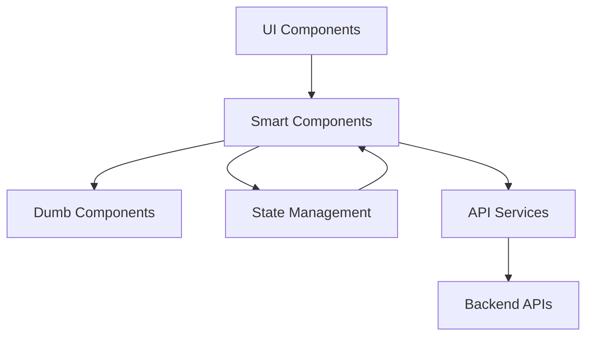
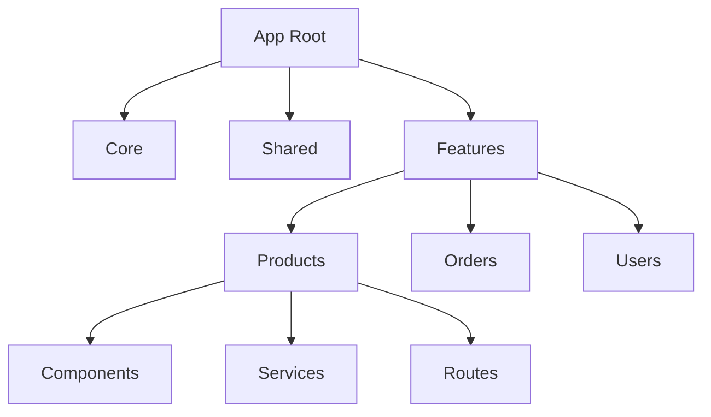
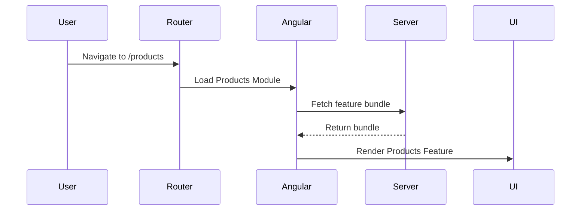
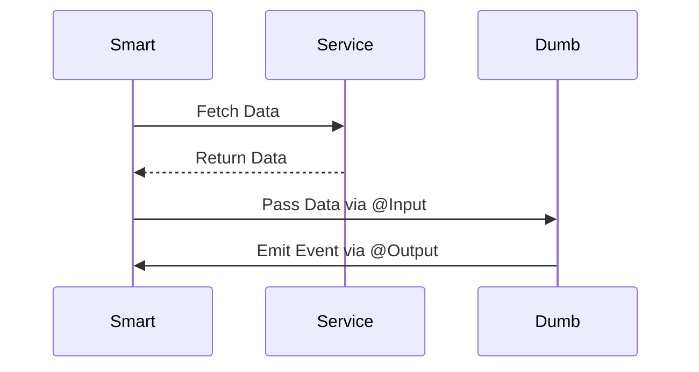
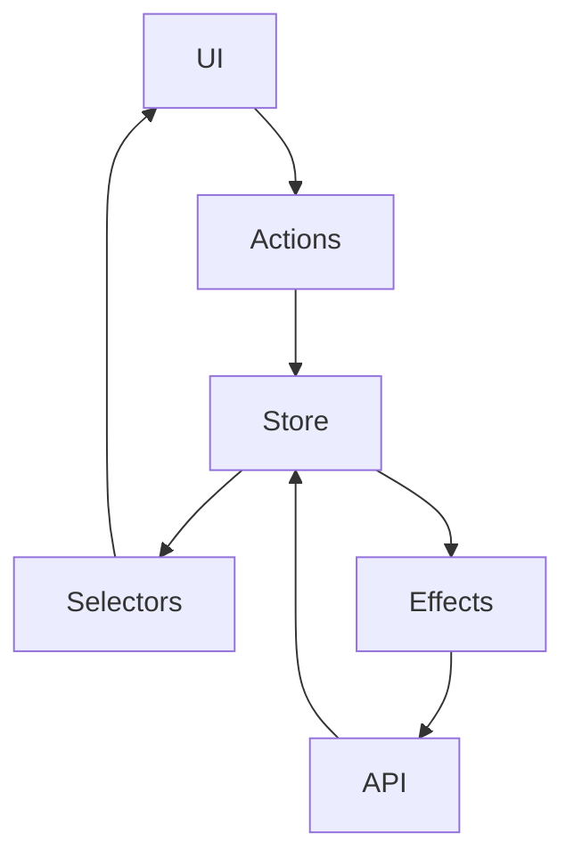
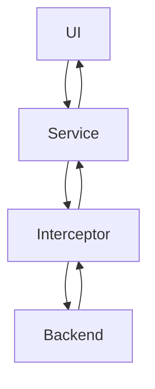
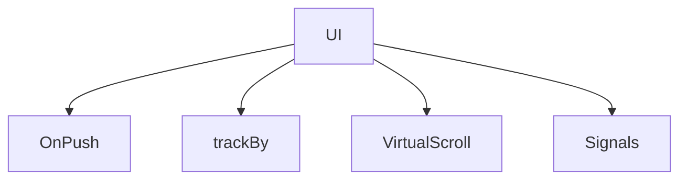
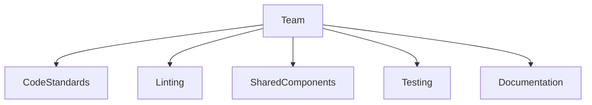

# 🏗️ Angular Scalable Architecture — Diagrams
## 1️⃣ High-Level Application Architecture

**Explanation:**
* UI = what user sees
* Smart components handle logic
* Dumb components render UI
* State layer manages app data
* API layer talks to backend

## 2️⃣ Feature-Based Folder Architecture

**Explanation:**
Each feature is isolated and independently scalable.

## 3️⃣ Lazy Loading Flow

**Explanation:**
Feature loads **only when needed**, improving performance.

## 4️⃣ Smart vs Dumb Component Interaction

**Explanation:**

* Smart = logic + API
* Dumb = UI only

## 5️⃣ State Management Data Flow

**Explanation:**
Predictable one-way data flow = fewer bugs.

## 6️⃣ API Layer with Interceptors

**Explanation:**
Interceptors handle auth, errors, and loaders globally.

## 7️⃣ Performance Optimization Architecture

**Explanation:**
Multiple small optimizations = big performance gains.

## 8️⃣ Team Scalability Architecture

**Explanation:**
Good architecture scales not just code — but **people**.

